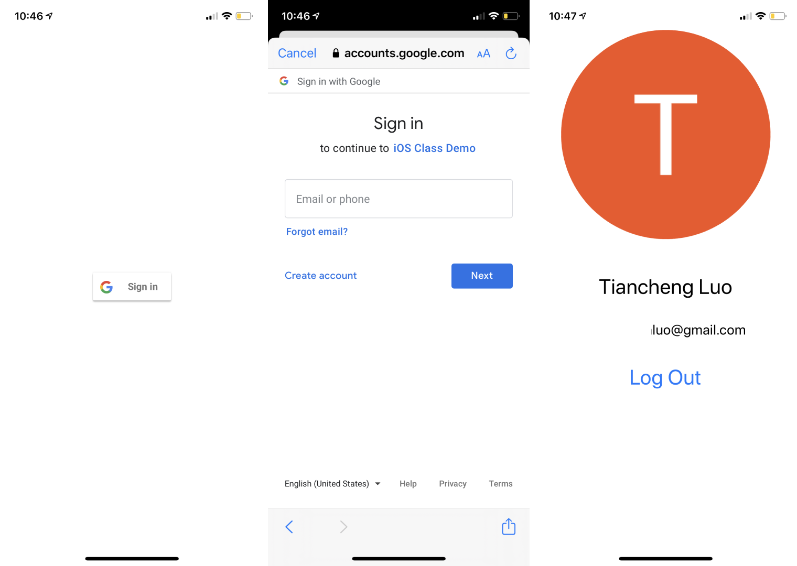

# Google Sign In Demo with UserDefaults

This demo shows you how to let users sign in their Google account in your app. The demo app uses UserDefaults to save persistent data, but feel free to use other frameworks, such as Core Data.

## Google Sign In

You can follow [this guide](https://developers.google.com/identity/sign-in/ios/start-integrating) to integrate Google Sign-In into your app. 

Here are some key steps:

* Install `GoogleSignIn` SDK through [CocoaPods](https://cocoapods.org/);
* Create a new project in [Google Developers Console](https://console.developers.google.com/), set up [OAuth Credentials](https://console.developers.google.com/apis/credentials?project=_) and [OAuth Consent Screen](https://console.developers.google.com/apis/credentials/consent?project=_);
* Add the reversed client ID as a URL scheme to your project;
* Import `GoogleSignIn` into `AppDelegate.swift`, and add `GIDSignInDelegate` as one of `AppDelegate`’s protocols;
* Write code in `application:didFinishLaunchingWithOptions:`, `application:openURL:options:`,  and `sign: didSignInFor: withError:` to handle Google Sign In;
* Write extra code in `ViewController` to handle sign in button and other logic.

Notice that the login process happens out of your app (in the system browser), so you have to set up the URL scheme for the browser to callback when the login process finished. Most account providers prohibit login through the built-in app browser as the app can capture user inputs.

Also, if you want to support multiple account providers (e.g., Google, Facebook, Twitter, etc.), you should rewrite `application:openURL:options:` carefully as the URL Scheme for one account provider may conflict with another one.

## UserDefaults

You can use `UserDefaults.standard.set(TYPE, forKey: String)` to save data. `TYPE` can be `Int` , `Float`, `Double`, `Bool`, or `Any`.

To retrieve the data, use `UserDefaults.standard.TYPE(forKey: String)`.

Please check [this documentation](https://developer.apple.com/documentation/foundation/userdefaults) for more details.

## Demo

To use this demo, run `pod install` in the demo project folder to install all the dependencies. After that, open `GoogleSignInDemo.xcworkspace` and run it. The app will show a sign in button. After clicking the button and signing in with your Google account, the app will show your name with email address and photo.

*Please note that this demo project needs a OAuth client ID to support the sign in process, and people should never share this information online ever. I include my id in `AppDelegate.swift` and URL Scheme for demonstration purposes only. I may revoke this key if it gets abused.*